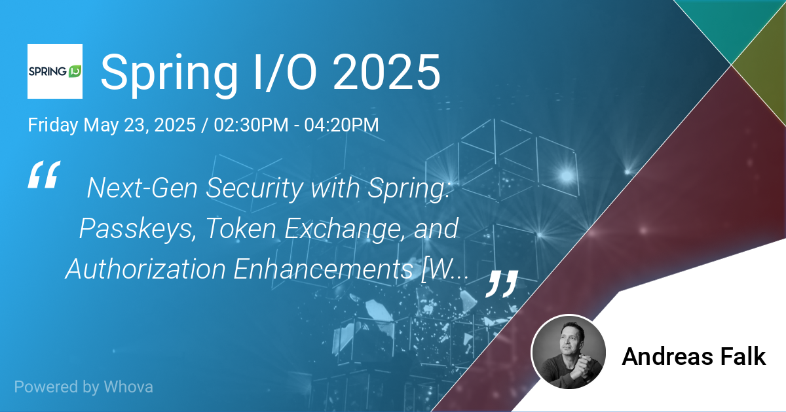

## Next-Gen Security with Spring Workshop

### Passkeys, Token Exchange and Authorization Enhancements

Hands-On Workshop at [Spring I/O 2025](https://2025.springio.net/) in Barcelona, Spain.  
More details on the workshop can be found [here](https://2025.springio.net/sessions/next-gen-security-with-spring-passkeys-token-exchange-and-authorization-enhancements-workshop/).

## Prerequisites

- **Java Development Kit (JDK)**: Ensure you have JDK 21 or higher installed. You can download the latest version from the [Oracle website](https://www.oracle.com/java/technologies/javase/jdk21-archive-downloads.html) or use a package manager like Homebrew (for macOS) or SDKMAN! (for Linux or macOS).
- **Java IDE**: You can use any Java IDE of your choice, such as IntelliJ IDEA, Eclipse, or Visual Studio Code. Make sure to install the necessary plugins for Maven support.
- **Passkeys**: If you want to run the Passkeys demo, you will require a compatible OS and browser. The Passkeys demo is designed and tested to work with macOS and Chrome, but it may also work with other operating systems, browsers and 3rd party apps that support Passkeys (i.e., 1Password).

## Workshop Tutorial

To follow along with the workshop, you can clone this repository and then follow the step-by-step instructions in the corresponding [workshop tutorial](https://andifalk.gitbook.io/spring-io-2025-security-workshop).

## Workshop Labs

- [Passkeys](labs/passkeys/README.md)
- [Enhancements of Authorization](labs/enhanced-authorization/README.md)
- [Token Exchange](labs/token-exchange/README.md)
