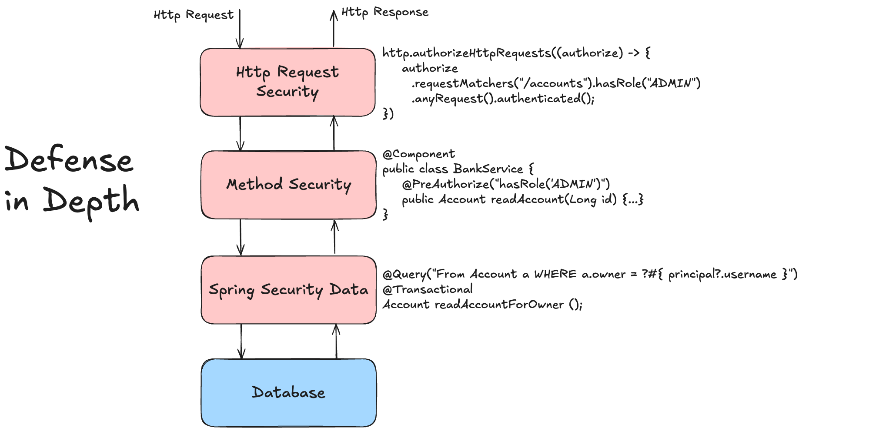

# 🧪 Enhanced Authorization Lab

## 🎯 Objective

Learn about the latest innovations in Authorization features of Spring Security.
Details on Spring Security Authorization can be found in the [Spring Security Reference Documentation](https://docs.spring.io/spring-security/reference/servlet/authorization/index.html).



This implements a well-known security principle called [Defense in depth](https://csrc.nist.gov/glossary/term/defense_in_depth)

---

### Step 1: Get to know the provided application

The provided application is a simple Spring Boot application that demonstrates the latest Authorization features of Spring Security.
The use case is a simple online banking application with bank accounts owned by different users.

This is the `BankAccount` entity class that represents a bank account in the application (see [Spring Data JPA Reference](https://docs.spring.io/spring-data/jpa/reference/jpa/entity-persistence.html) if you are not familiar with JPA and/or Spring Data JPA):

```java
import com.fasterxml.jackson.annotation.JsonIgnore;
import com.fasterxml.jackson.databind.annotation.JsonSerialize;
import jakarta.persistence.Entity;
import org.springframework.data.jpa.domain.AbstractPersistable;

import java.math.BigDecimal;
import java.util.Objects;

@JsonSerialize(as = BankAccount.class)
@Entity
public class BankAccount extends AbstractPersistable<Long> {
    private String owner;
    private String accountNumber;
    private BigDecimal balance;

    public BankAccount() {
    }

    public BankAccount(long id, String owner, String accountNumber, BigDecimal balance) {
        this.owner = owner;
        this.accountNumber = accountNumber;
        this.balance = balance;
    }

    public String getOwner() {
        return owner;
    }

    public String getAccountNumber() {
        return accountNumber;
    }

    public BigDecimal getBalance() {
        return balance;
    }

    // further code omitted
}
```

The application uses a simple in-memory database (H2) to store the bank accounts.
The `BankAccount` entity class extends the `AbstractPersistable` class, which provides a simple way to manage the entity's ID and version.

**Note, if Spring Security 6.3 is used:**
As we will use Jackson (for JSON), we need to set the annotation `@JsonSerialize(as = BankAccount.class)` on top of the class. This is due to how Jackson works with CGLIB proxies (Spring Security needs proxies to make enhanced authorizations work).
Otherwise, this may result in a serialization error like the following:
`com.fasterxml.jackson.databind.exc.InvalidDefinitionException: Direct self-reference leading to cycle`

The application provides a simple REST API that allows users to create, view and update their bank accounts.

| Endpoint                | Description                                           |
|-------------------------|-------------------------------------------------------|
| GET /api/accounts       | Administrative Endpoint to get all existing accounts  |
| GET /api/accounts/{id}  | Retrieve a single account by its unique identifier    |
| POST /api/accounts      | Create a new account for currently authenticated user |
| POST /api/accounts/{id} | Increase the account balance by given amount          |

Here is the code for the REST API:

```java
@RestController
@RequestMapping("/api/accounts")
public class BankAccountApi {

    private final BankAccountService bankAccountService;

    public BankAccountApi(BankAccountService bankAccountService) {
        this.bankAccountService = bankAccountService;
    }

    @GetMapping
    List<BankAccount> findAll() {
        return bankAccountService.findAll();
    }

    @GetMapping("/{id}")
    ResponseEntity<BankAccount> findById(@PathVariable("id") long id) {
        BankAccount bankAccount = bankAccountService.findById(id);
        return bankAccount != null ? ResponseEntity.ok(bankAccount) : ResponseEntity.notFound().build();
    }

    @PostMapping
    BankAccount save(@RequestBody BankAccount toSave) {
        return bankAccountService.save(toSave);
    }

    @PostMapping("/{id}")
    ResponseEntity<String> update(@PathVariable("id") long id, @RequestBody BankAccount toUpdate) {
        boolean updated = bankAccountService.update(id, toUpdate);
        if (updated) {
            return ResponseEntity.ok().build();
        } else {
            return ResponseEntity.status(HttpStatus.FORBIDDEN.value()).build();
        }
    }
}
```

The Rest API delegates all calls to the `BankAccountService` class, which is responsible for the business logic and bridge to data access.

```java
import org.springframework.stereotype.Service;
import org.springframework.transaction.annotation.Transactional;

import java.util.List;

@Transactional(readOnly = true)
@Service
public class BankAccountService {

    private final BankAccountRepository bankAccountRepository;

    public BankAccountService(BankAccountRepository bankAccountRepository) {
        this.bankAccountRepository = bankAccountRepository;
    }

    List<BankAccount> findAll() {
        return bankAccountRepository.findAll();
    }

    BankAccount findById(long id) {
        return bankAccountRepository.findById(id).orElse(null);
    }

    @Transactional
    BankAccount save(BankAccount toSave) {
        return bankAccountRepository.save(toSave);
    }

    @Transactional
    boolean update(long id, BankAccount toUpdate) {
        return bankAccountRepository.updateBankAccount(id, toUpdate.getBalance()) == 1;
    }
}
```

The `BankAccountService` class is annotated with `@Transactional(readOnly = true)` to indicate that all methods are read-only by default. The `save` and `update` methods are annotated with `@Transactional` to indicate that they are write operations.

Finally, we approach the data access layer.
The `BankAccountRepository` class is a simple Spring Data JPA repository that provides CRUD operations for the `BankAccount` entity.

```java
import org.springframework.data.jpa.repository.JpaRepository;
import org.springframework.data.jpa.repository.Modifying;
import org.springframework.data.jpa.repository.Query;

import java.math.BigDecimal;

public interface BankAccountRepository extends JpaRepository<BankAccount, Long> {

    @Modifying
    @Query("UPDATE BankAccount a SET a.balance = a.balance + :amount WHERE a.id = :id AND a.owner = ?#{principal?.username}")
    int updateBankAccount(Long id, BigDecimal amount);
}
```

Please notice the method having `@Modifying` annotation on the `updateBankAccount` method. It also contains a custom query that updates the balance of a bank account only if the owner of the account matches the currently authenticated user. This is an example of how to use Spring Security to restrict access to data based on the user's role. This is basically done by using the `?#{principal?.username}` expression in the query. This is enabled through the Spring Data Security extension defined in class `WebSecurityConfiguration`.

```java
import org.springframework.security.data.repository.query.SecurityEvaluationContextExtension;

// further code omitted

@Bean
public SecurityEvaluationContextExtension securityEvaluationContextExtension() {
  return new SecurityEvaluationContextExtension();
}
```

And it also requires a special dependency in the `pom.xml`:

```xml
<dependency>
   <groupId>org.springframework.security</groupId>
   <artifactId>spring-security-data</artifactId>
</dependency>
```

Let's start the application (`./mvnw spring-boot:run`) and test the API with the following credentials:

| Username   | Password | Role(s)          |
|------------|----------|------------------|
| user       | secret   | USER             |
| admin      | secret   | USER, ADMIN      |
| accountant | secret   | USER, ACCOUNTANT |

To test the application, you can use one of the provided HTTP client files in the `requests` folder of the module:

- `api-call.http`: The IntelliJ Http client
- `api-call.httpie`: The command line [Httpie](https://httpie.io/) client
- `api-call.curl`: The command line [Curl](https://curl.se/) client

What do you think about the responses of the different API calls?  
It looks like there are issues with the authorization of the API calls. So there is work to do!

But first let's have a look at the (new and enhanced) method authorization features in Spring Security.

---

### Step 2: Get to know the new and enhanced method Authorization Features

An application can use Spring Security to secure the REST API and restrict access to the method (service) layer.
This is basically done by using annotations like `@PreAuthorize`, `@PostAuthorize` and `@AuthorizeReturnObject` on the service methods or domain objects.

**Summary of Annotations**

| Annotation                   | When it runs        | Use case                                  |
|------------------------------|---------------------|-------------------------------------------|
| `@PreAuthorize`              | Before method call  | Guard method based on roles or parameters |
| `@PostAuthorize`             | After method call   | Guard method based on return value        |
| `@PreFilter`                 | Before method call  | Filter input collections                  |
| `@PostFilter`                | After method call   | Filter returned collections               |
| `@AuthorizeReturnObject`     | After return (6.3+) | Object-level security on returned object  |
| `@HandleAuthorizationDenied` | Interception (6.3+) | Custom handling of authorization failures |

#### Annotation Details

✅ @PreAuthorize

Runs before the method and prevents execution if the expression is false.
```java
@PreAuthorize("hasRole('ADMIN')")
public void deleteUser(String userId) { 
    //... 
}
```
🧠 Common use cases:
- Role-based access
- Ownership checks: @PreAuthorize("#userId == authentication.name")

✅ @PostAuthorize

Runs after the method and prevents return if the expression is false. This allows checking the returned object.

```java
@PostAuthorize("returnObject.owner == authentication.name")
public Document getDocument(String docId) {
   //... 
   return document;
}
```

🧠 Use this when you need to inspect the returned domain object to enforce access control.

✅ @PreFilter

Filters collection input parameters before the method executes.

```java
@PreFilter("filterObject.owner == authentication.name")
public void updateDocuments(List<Document> docs) { 
    //... 
}
```

🧠 filterObject is a special variable that refers to each item in the collection.

✅ @PostFilter

Filters the collection result after method execution.

```java
@PostFilter("filterObject.visibility == 'public' or filterObject.owner == authentication.name")
public List<Document> findAll() { 
    //... 
}
```

🧠 This is useful when returning a list of domain objects and you want to hide some from the caller.

✅ @AuthorizeReturnObject (Spring Security 6.3+)

A new alternative to @PostAuthorize, more structured and composable

```java
@AuthorizeReturnObject
public Document findById(String id) { 
    //... 
}
```

This can be combined with @PreAuthorize on parts of the domain object to enforce a bit more fine-grained object security.

```java
 @PreAuthorize("this.owner == authentication?.name")
 public String getSecretDocumentDetails() {
     return secretDocumentDetails;
 }
```

✅ @HandleAuthorizationDenied (Spring Security 6.3+)

This allows you to intercept and customize the behavior when an authorization check fails at a method level 
(e.g., in `@PreAuthorize`, `@AuthorizeReturnObject`, etc.).

```java
 @PreAuthorize("this.owner == authentication?.name")
 @HandleAuthorizationDenied(handlerClass = MaskMethodAuthorizationDeniedHandler.class)
 public String getSecretDocumentDetails() {
     return secretDocumentDetails;
 }
```

🧠 This is useful when you want to mask or log the failure instead of throwing an exception.

In the next step we will now implement the new and enhanced method authorization features in the provided application.

---

### Step 3: Add the new and enhanced Authorization Features to the application

Now it is the time to add the missing authorization to the application.

#### Spring Security Annotation Parameters

At first let's create some custom Authorization annotations to show the [Annotations Parameters](https://docs.spring.io/spring-security/reference/6.3/whats-new.html#_annotation_parameters_14480) feature introduced in Spring Security 6.3. Later we will add these to the `BankAccountService` class.

The `PreGetBankAccounts` and `PreWriteBankAccount` annotations are custom security annotations that are used to restrict access to the methods based on the user's role and ownership of the bank account. Please create these two classes in the `security` package.

**PreGetBankAccounts:**

```java
import org.springframework.security.access.prepost.PreAuthorize;

import java.lang.annotation.ElementType;
import java.lang.annotation.Retention;
import java.lang.annotation.RetentionPolicy;
import java.lang.annotation.Target;

@Retention(RetentionPolicy.RUNTIME)
@Target(ElementType.METHOD)
@PreAuthorize("hasRole('{role}')")
public @interface PreGetBankAccounts {
   @AliasFor(attribute = "value") 
   String role();
}
```

**PreWriteBankAccount:**

```java
import org.springframework.core.annotation.AliasFor;
import org.springframework.security.access.prepost.PreAuthorize;

import java.lang.annotation.Retention;
import java.lang.annotation.RetentionPolicy;

@Retention(RetentionPolicy.RUNTIME)
@PreAuthorize("{account}?.owner == authentication?.name")
public @interface PreWriteBankAccount {
   String value() default "#account";

   @AliasFor(attribute = "value")
   String account() default "#account";
}
```

Let us add these annotations to the `BankAccountService` class:

```java
import org.example.features.security.PostReadBankAccount;
import org.example.features.security.PreGetBankAccounts;
import org.example.features.security.PreWriteBankAccount;
import org.springframework.stereotype.Service;
import org.springframework.transaction.annotation.Transactional;

import java.util.List;

@Transactional(readOnly = true)
@Service
public class BankAccountService {

   private final BankAccountRepository bankAccountRepository;

   public BankAccountService(BankAccountRepository bankAccountRepository) {
      this.bankAccountRepository = bankAccountRepository;
   }

   @PreGetBankAccounts(role = "ADMIN")
   List<BankAccount> findAll() {
      return bankAccountRepository.findAll();
   }

   BankAccount findById(long id) {
      return bankAccountRepository.findById(id).orElse(null);
   }

   @PreWriteBankAccount("#toSave")
   @Transactional
   BankAccount save(BankAccount toSave) {
      return bankAccountRepository.save(toSave);
   }

   @PreWriteBankAccount("#toUpdate")
   @Transactional
   boolean update(long id, BankAccount toUpdate) {
      return bankAccountRepository.updateBankAccount(id, toUpdate.getBalance()) == 1;
   }
}
```

✅ Explanation:
- **@PreGetBankAccounts(role = "ADMIN")** is a custom-composed parameterized annotation built on top of @PreAuthorize
- When `findAll()` is called, Spring Security will:
  1. Resolve the annotation parameter role = "ADMIN"
  2. Evaluate the SpEL expression hasRole() → becomes hasRole('ADMIN')
  3. Check if the currently authenticated user has the authority ROLE_ADMIN
  4. If the check passes, proceed to call findAll()
  5. Otherwise, throw an AccessDeniedException
- **@PreWriteBankAccount** is a custom-composed parameterized annotation built on top of @PreAuthorize
  1. Spring sees @PreWriteBankAccount("#toSave")
  2. The expression #toSave is passed to the account attribute of the annotation
  3. Inside the annotation, {account} is replaced with #toSave
  4. The resulting @PreAuthorize becomes:
     `@PreAuthorize("#toSave?.owner == authentication?.name")`
  5. At runtime, before executing `save()`, Spring evaluates whether: `toSave.owner == currentlyAuthenticatedUser.name`

Restart the application and test the API again (with the previously introduced credentials above)

Now most Authorizations should now work as expected.

#### Secure Return Values and Authorization Error Handling

Since Spring Security 6.3+ also supports wrapping any object that is annotated its method security annotations. The simplest way to achieve this is to mark any method that returns the object you wish to authorize with the `@AuthorizeReturnObject` annotation.

The `@AuthorizeReturnObject` annotation instructs Spring Security to check the returned object against the security expression. This is a new feature introduced in Spring Security 6.3 as well and allows you to restrict access to the returned domain object based on the user's role and the returned object's properties.

We want to try this now on our domain entity.
Here is what the `BankAccount` entity class looks like after adding the `@PreAuthorize` and `@HandleAuthorizationDenied` annotation:

```java
import com.fasterxml.jackson.annotation.JsonIgnore;
import com.fasterxml.jackson.databind.annotation.JsonSerialize;
import jakarta.persistence.Entity;
import org.example.features.security.MaskMethodAuthorizationDeniedHandler;
import org.springframework.data.jpa.domain.AbstractPersistable;
import org.springframework.security.access.prepost.PreAuthorize;
import org.springframework.security.authorization.method.HandleAuthorizationDenied;

import java.math.BigDecimal;
import java.util.Objects;

@JsonSerialize(as = BankAccount.class)
@Entity
public class BankAccount extends AbstractPersistable<Long> {
    private String owner;
    private String accountNumber;
    private BigDecimal balance;

    // previous code omitted

    @PreAuthorize("this.owner == authentication?.name")
    @HandleAuthorizationDenied(handlerClass = MaskMethodAuthorizationDeniedHandler.class)
    public String getAccountNumber() {
        return accountNumber;
    }

    // further code omitted
}
```

`@HandleAuthorizationDenied` references the `MaskMethodAuthorizationDeniedHandler` class, which is a custom authorization-denied handler that is used to mask the account number if the user is not authorized to access it.

Let's see how this is defined in a new class called `MaskMethodAuthorizationDeniedHandler`, create this in the `security` package:

```java
import org.aopalliance.intercept.MethodInvocation;
import org.springframework.security.authorization.AuthorizationResult;
import org.springframework.security.authorization.method.MethodAuthorizationDeniedHandler;
import org.springframework.stereotype.Component;

@Component
public class MaskMethodAuthorizationDeniedHandler implements MethodAuthorizationDeniedHandler {
    @Override
    public Object handleDeniedInvocation(MethodInvocation methodInvocation, AuthorizationResult authorizationResult) {
        return "*****";
    }
}
```

Finally, we need to activate the validation of authorization checks on our domain object.
We achieve this by adding another customized annotation.

The `PostReadBankAccount` annotation is a custom security annotation that is used to restrict access to the method based on the user's role and the returned object. Create a new class called `PostReadBankAccount` in the `security` package:

```java
import org.springframework.security.access.prepost.PostAuthorize;
import org.springframework.security.authorization.method.AuthorizeReturnObject;

import java.lang.annotation.Retention;
import java.lang.annotation.RetentionPolicy;

@Retention(RetentionPolicy.RUNTIME)
@PostAuthorize("returnObject?.owner == authentication?.name or hasRole('ACCOUNTANT')")
@AuthorizeReturnObject
public @interface PostReadBankAccount {
}
```

We also need to add this annotation to the `findById` method in the `BankAccountService` class:

```java
import org.example.features.security.PostReadBankAccount;
import org.example.features.security.PreGetBankAccounts;
import org.example.features.security.PreWriteBankAccount;
import org.springframework.stereotype.Service;
import org.springframework.transaction.annotation.Transactional;

import java.util.List;

@Transactional(readOnly = true)
@Service
public class BankAccountService {

    private final BankAccountRepository bankAccountRepository;

    public BankAccountService(BankAccountRepository bankAccountRepository) {
        this.bankAccountRepository = bankAccountRepository;
    }

    @PreGetBankAccounts(role = "ADMIN")
    List<BankAccount> findAll() {
        return bankAccountRepository.findAll();
    }

    @PostReadBankAccount
    BankAccount findById(long id) {
        return bankAccountRepository.findById(id).orElse(null);
    }

    @PreWriteBankAccount("#toSave")
    @Transactional
    BankAccount save(BankAccount toSave) {
        return bankAccountRepository.save(toSave);
    }

    @PreWriteBankAccount("#toUpdate")
    @Transactional
    boolean update(long id, BankAccount toUpdate) {
        return bankAccountRepository.updateBankAccount(id, toUpdate.getBalance()) == 1;
    }
}
```

### Step 4: Start the application and test the API

1. Restart the application by running the `BankAccountApplication` class.
   - You can do this by right-clicking on the class and selecting **Run** or by using the command line:
   ```bash
   ./mvnw spring-boot:run
   ```

2. Re-test the API.
    - All authorizations should work now as expected.
    - If the user has restricted access rights, the account number is being masked out.