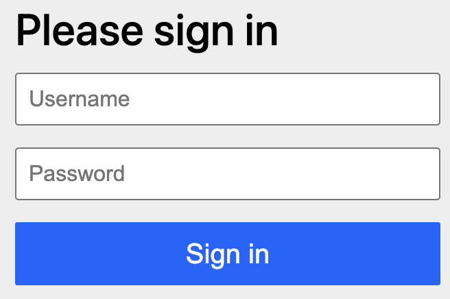
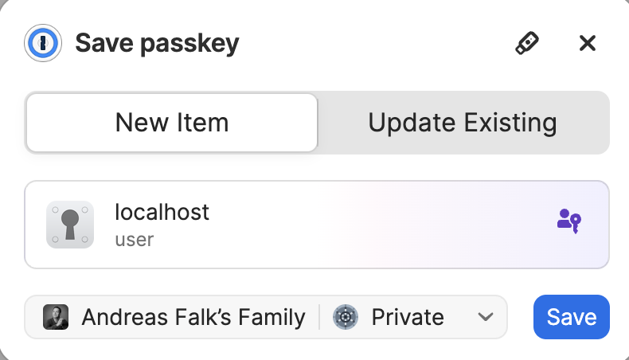
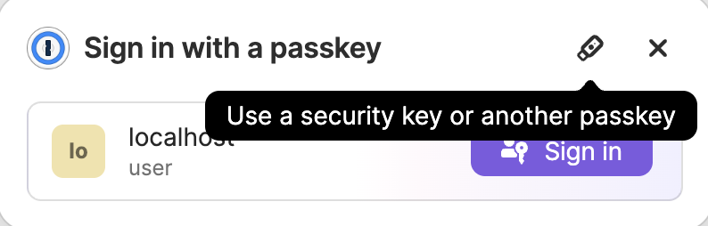

# 🧪 Authentication with Passkeys Lab

## 🎯 Objective

Learn how authentication with Passkeys works and is implemented using Spring Security.

### 📖 Background

It is often a bit confusing to understand the difference between Passkeys, FIDO2 and WebAuthn. To clarify this, here is a short overview with a few analogies:

- 🧱 WebAuthn: This is the Engine
- 🛞 Passkeys: The user-friendly car built around it
- 🛞 Passkeys are FIDO2 sign-in credentials

More details on Passkeys can be found in the [passkeys.dev](https://passkeys.dev/) and the [WebAuthn Overview](https://webauthn.guide/).  
You may also have a look into the specifications of [WebAuthn](https://www.w3.org/TR/webauthn-2/), [Client to Authenticator Protocol (CTAP)](https://fidoalliance.org/specs/fido-v2.2-ps-20250228/fido-client-to-authenticator-protocol-v2.2-ps-20250228.html) and [FIDO2](https://fidoalliance.org/fido2/).


Details on implementing for Passkeys can be found in the [Spring Security Reference Documentation](https://docs.spring.io/spring-security/reference/servlet/authentication/passkeys.html).

## 🧰 Lab Prerequisites

Check if your operating system supports Passkeys. If not, you can use a cross-device secret store like 1Password to register and use Passkeys.


> 💡 **Note:** Passkeys are supported to run on `localhost` without any TLS certificate. However, this is not recommended for production use. For production use, you need a valid TLS certificate for your domain.


---

## 🔹 Lab 1: Passkeys (on localhost)

### Step 1: Get to know the provided application

The `passkeys` directory contains a simple Spring Boot application that demonstrates how to use Passkeys for authentication. The application is configured with a main index.html page containing all important links for the demonstration scenario.

Start the application using your IDE or using the maven spring boot plugin with 
```bash
./mvnw spring-boot:run
```

Then navigate to [localhost:8080](http://localhost:8080). 

First you need to log in with the user credentials `user` and `password`.



You should see a welcome page with the following links:

- **Register**: Click on this link to register your user for a Passkey (using Keychain on Mac, Browser, 1Password, etc.)
- **Call Hello API**: This calls a testing API that welcomes you as a user
- **Log Out**: Force a logout, i.e., to test logging in using a passkey


> 💡 **Note**: The **Register** link will cause an error as we have not yet configured Passkeys hence the registration URL does not exist.

Before continuing to the next step, stop the application using `Ctrl+C` in the terminal or using your IDE.

---

### Step 2: Extend the application for Passkeys

Now it is time to get **Passkeys** working in the application. 

The application already contains the necessary dependencies for Passkeys. You can find the configuration in the `pom.xm` file.

```xml
<dependency>
    <groupId>org.springframework.boot</groupId>
    <artifactId>spring-boot-starter-security</artifactId>
</dependency>
<dependency>
    <groupId>com.webauthn4j</groupId>
    <artifactId>webauthn4j-core</artifactId>
    <version>0.29.0.RELEASE</version>
</dependency>
```

Next up is the configuration of the `WebSecurityConfiguration` class. This class is responsible for configuring the security filter chain and thus enabling Passkeys.

So let's add the corresponding code snippet to the `WebSecurityConfiguration` class:

```java
@Configuration
@EnableWebSecurity
public class WebSecurityConfiguration {

    @Bean
    public SecurityFilterChain securityFilterChain(HttpSecurity http) throws Exception {
        http.authorizeHttpRequests(
                        authorizeRequests -> {
                            authorizeRequests.requestMatchers("/login/**", "/message", "/error").permitAll();
                            authorizeRequests.anyRequest().authenticated();
                        }
                )
                .headers(headers -> headers.httpStrictTransportSecurity(HstsConfig::disable))
                .httpBasic(withDefaults())
                .formLogin(withDefaults())
                // add this snippet for webAuthn support to enable Passkeys
                .webAuthn((webAuthn) -> webAuthn
                        .rpName("Spring Security Relying Party")
                        .rpId("localhost")
                        .allowedOrigins("http://localhost:8080")
                );
        return http.build();
    }
    //... other beans and configuration
}
```

📌 Parameter Explanations

1. **.rpName**("Spring Security Relying Party")
   - rpName = “Relying Party Name”
   - Human-readable name of your application or service (e.g. "GitHub" or "MyApp").
   - Shown to users during credential registration (passkey creation) in browser prompts.
   
    🧠 Think of it as the “display name” of your app during passkey registration.

2. **.rpId**("example.com")
   - rpId = “Relying Party ID”
   - The domain name of the relying party (your service).
   - Used to scope the credential (passkey is only usable for this RP ID).
   - Must match or be a parent domain of the domain used to access the site.

   ⚠️ rpId must match the origin used in the browser, e.g.:
   - If your frontend runs at https://login.example.com, then rpId can be example.com
   - If it’s http://localhost, your rpId must be localhost

3. **.allowedOrigins**("https://example.com")
   - Defines which origins are allowed to initiate WebAuthn operations.
   - Origin = scheme + domain + port, e.g. https://example.com:443
   - Helps prevent WebAuthn requests from unauthorized websites (same-origin policy enforcement).

✅ Must exactly match what the browser sees as URL — including https and any custom port.

---

### Step 3: Run the application (with Passkeys)

Restart the application in your IDE or using the maven spring boot plugin with 

```bash
./mvnw spring-boot:run
```

Now navigate your browser to [localhost:8080](http://localhost:8080). 

You will notice already that the login page has changed. In addition to the standard login, you can now log in using your Passkey.

We will now see how to register and use a Passkey in the next section.

#### Test Scenario

##### 1.Login with username and password

First login again using the standard login with username and password. Use `user` and `password` as credentials. Otherwise, we are not able to register the Passkey.


##### 2.Register

Click on the register link and follow the instructions to register your Passkey. You can use your browser's built-in Passkey support or a third-party application like 1Password.  
The Passkey label is the name of the Passkey you want to register. You can use any name you like, but it is recommended to use a meaningful name that you can remember.


If you are using a third-party authenticator like [1Password](https://1password.com/solutions/passwordless), you will be prompted to create a Passkey using the 1Password application.



If you are using a browser on a supported operating system, you will be prompted to create a Passkey using the built-in Passkey support (i.e., Apple Password or Windows Hello).


##### 3.Login with Passkey

After registering your Passkey, you can log in using the Passkey. But first we need to log out of the application using the URL [http://localhost:8080/logout](http://localhost:8080/logout) to force getting the login screen again.  
Now click on the **Login with Passkey** link and follow the instructions to log in using the Passkey. 

> 💡 **Note**: The concrete Passkey flow is dependent on your operating system, installed applications (i.e., if you use an external password manager that supports Passkeys) and your configuration.

In case you have a configured third-party authenticator, you will be prompted to use that authenticator to log in.



If you want to use another passkey or another device, you can select the Passkey you want to use. This is the cross-device feature of Passkeys.  
You will then be prompted to select the Passkey you want to use.


If you have used your phone or another device to register the Passkey, you will be prompted to use that device to log in. This is the cross-device feature of Passkeys.


##### 4.Call Hello API

After logging in with the Passkey, you will be redirected to the welcome page. Click on the **Call Hello API** link to call the testing API that welcomes you as a user.

Look inside the `src/main/java/com/example/passkeys/HelloApi.java` class to see how the `Principle` differs depending on the Authentication mechanism. 

```java
@RestController
public class HelloApi {

    private static final Logger LOG = LoggerFactory.getLogger(HelloApi.class);

    @GetMapping("/hello")
    public String hello(@AuthenticationPrincipal(errorOnInvalidType = true) Object principal) {
        LOG.info("Principal = {}!", principal);

        return switch (principal) {
            case User user -> "Hello, " + user.getUsername() + "!";
            case PublicKeyCredentialUserEntity publicKeyCredentialUserEntity ->
                    "Hello, " + publicKeyCredentialUserEntity.getName();
            case Principal principal1 -> "Hello, " + principal1.getName() + "!";
            case null, default -> "Hello " + principal;
        };
    }
}
```

- If you are authenticating with a username and password, the `principal` will be of type `User`.
- If you are authenticating with a Passkey, the `principal` will be of type `PublicKeyCredentialUserEntity`.

✅ That's it! You have successfully implemented Passkeys authentication in your Spring Boot application. 

>💡 **Note**: The optional lab 2 shows how to implement Passkeys with a secure local domain. This lab is intended to be done as *home work*. Instead, we will proceed with the next topic **Enhanced Authorization**.

---

## 🔹 Lab 2: Passkeys with a secure local domain (optional lab)

### 🧰 Lab Prerequisites

In addition to the previous lab prerequisites, you need the following:
- A working local domain (e.g., `server.test`) with a valid TLS certificate
- [mkcert](https://github.com/FiloSottile/mkcert) installed on your machine to create a local CA and trusted certificates

### 🛠️ Setup

#### mkcert

To quickly set up a TLS configuration required for Passkeys, we need to install the tool [mkcert](https://github.com/FiloSottile/mkcert). [mkcert](https://github.com/FiloSottile/mkcert) is a simple tool for making locally trusted development certificates.

On **macOS**, you can install [mkcert](https://github.com/FiloSottile/mkcert) using Homebrew:

```bash
brew install mkcert
brew install nss # if you use Firefox
```

On **Windows**, you can install [mkcert](https://github.com/FiloSottile/mkcert) using Chocolatey:

```bash
choco install mkcert
```

or just install the binaries from the [mkcert releases page](https://github.com/FiloSottile/mkcert/releases)

On **Linux**, you can install [mkcert](https://github.com/FiloSottile/mkcert) using the pre-built binaries:

```bash
curl -JLO "https://dl.filippo.io/mkcert/latest?for=linux/amd64"
chmod +x mkcert-v*-linux-amd64
sudo cp mkcert-v*-linux-amd64 /usr/local/bin/mkcert
```

### Step 1: Create a local CA

Using Passkeys with most providers requires secure HTTPS connections and does not work with the localhost domain.
Therefore, this sample is configured for https://server.test:8433 address.

[RFC 2606](https://www.rfc-editor.org/rfc/rfc2606.html) officially reserves the following domains for testing and development:

- `.test`
- `.example`
- `.invalid`
- `.localhost`

To enable this local domain on your machine, on **macOS** and **Linux** you need to add the following entry to your `/etc/hosts` file:

```shell
127.0.0.1 server.test
```

On **Windows 11**, you can add the entry to the `C:\Windows\System32\drivers\etc\hosts` file.

```shell
127.0.0.1 server.test
```

After installing [mkcert](https://github.com/FiloSottile/mkcert), you need to create a local CA (Certificate Authority) that will be used to sign the certificates for your local domain. This will also import the root certificate into your system's trust store, Java and browsers:

```bash
mkcert -install
```

After installing the local CA with the root certificate, it is time to create a keystore containing the required certificate:

```shell
mkcert -p12-file server-keystore.p12 -pkcs12 127.0.0.1 localhost server.test
```

Finally, copy the generated `server-keystore.p12` file to the `src/main/resources` directory of the `passkeys` module.

The application is configured to use the `server-keystore.p12` file for TLS.

### Step 2: Extend the application for Passkeys

Same as in Lab1, we need to extend the `WebSecurityConfiguration` class to enable Passkeys.
But this time we need to change the `rpId` and `allowedOrigins` to match the secure `.test` domain.

```java
@Configuration
@EnableWebSecurity
public class WebSecurityConfiguration {

    @Bean
    public SecurityFilterChain securityFilterChain(HttpSecurity http) throws Exception {
        http.authorizeHttpRequests(
                        authorizeRequests -> {
                            authorizeRequests.requestMatchers("/login/**", "/message", "/error").permitAll();
                            authorizeRequests.anyRequest().authenticated();
                        }
                )
                .headers(headers -> headers.httpStrictTransportSecurity(HstsConfig::disable))
                .httpBasic(withDefaults())
                .formLogin(withDefaults())
                // add this snippet for webAuthn support to enable Passkeys
                .webAuthn((webAuthn) -> webAuthn
                        .rpName("Spring Security Relying Party")
                        .rpId("server.test")
                        .allowedOrigins("https://server.test:8443")
                );
        return http.build();
    }
    //... other beans and configuration
}
```

### Step 3: Run the application

Start the application in your IDE or using the maven spring boot plugin with 

```bash
./mvnw spring-boot:run
```

Now navigate your browser to [https://server.test:8443](https://server.test:8443).

The remainder of the lab is the same as in Lab 1. You can follow the same steps as described in the test scenario of Lab 1 to test the Passkey authentication.

✅ That's it! You have successfully implemented Passkeys authentication in your Spring Boot application. And you have done this in a secure way using a local domain and TLS.