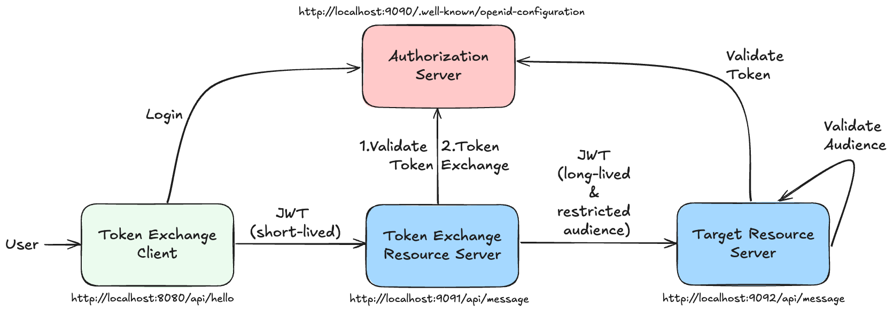

# 🧪 OAuth2 Token Exchange Lab

## 🎯 Objective

The goal of this lab is to demonstrate the OAuth2 Token Exchange feature in Spring Security and Spring Authorization Server.

### What is OAuth2 Token Exchange

According to [oauth.net](https://oauth.net/2/token-exchange/), the Token Exchange extension defines a mechanism for a client to obtain its own tokens given a separate set of tokens. 
This has several different applications, including:

- Single-sign-on between multiple mobile apps without launching a web browser
- A resource server exchanging a client's tokens for its own tokens

The [OAuth 2.0 Token Exchange (RFC 8693)](https://www.rfc-editor.org/rfc/rfc8693.html) defines how to request and obtain security tokens from OAuth 2.0 authorization servers, including security tokens employing impersonation and delegation.

The analogy between impersonation and delegation is similar to the difference between a user impersonating another user and a user delegating their authority to another user.

| Analogy                 | Impersonation 🕵️                 | Delegation 🤝                              |
|-------------------------|-----------------------------------|--------------------------------------------|
| **Real-world metaphor** | Pretending to be someone else     | Acting with someone's permission           |
| **Actor identity**      | Hidden (disguised as the subject) | Transparent (both actor and subject known) |
| **Audit logs**          | Show only the impersonated user   | Show both the original and delegated user  |
| **Power analogy**       | Borrowing someone's ID            | Acting under power of attorney             |
| **Common association**  | “Login as user” in admin panels   | Service A calling Service B for User X     |

The [OAuth 2.0 Token Exchange (RFC 8693)](https://www.rfc-editor.org/rfc/rfc8693.html) extension defines a mechanism for a client to obtain its own tokens given a separate set of tokens. This has several different applications, including:

| Aspect                 | Impersonation 🕵️                    | Delegation 🤝                                   |
|------------------------|--------------------------------------|-------------------------------------------------|
| **Definition**         | Acting *as* another user             | Acting *on behalf* of another user              |
| **Identity in token**  | Subject only (`sub = user`)          | Subject + Actor (`sub = user`, `act = caller`)  |
| **Who appears to act** | The impersonated user                | The original caller                             |
| **Access Rights**      | Fully inherit target user's rights   | Target user's rights, caller identity preserved |
| **Audit Visibility**   | Limited – only the impersonated user | Full – both subject and actor are visible       |
| **Use Case Example**   | Admin logs in as user                | API calling downstream with user context        |
| **Security Risk**      | Higher (hides true actor)            | Lower (identity chain is preserved)             |

---

### Step 1: Having a look into the provided code

This repository directory `token-exchange` contains all required component apps of the OAuth2 Token Exchange lab implemented with Spring Security and Spring
Authorization Server.

It includes four modules:

1. **spring-authorization-server**: A Spring Boot application that acts as an OAuth2 authorization server. 
   It is pre-configured with the required endpoints and client registrations.
2. **token-exchange-client**: A Spring Boot application that acts as an OAuth2 client.
3. **token-exchange-resource-server**: A Spring Boot application that acts as an OAuth2 resource server performing the token exchange and then calls the final target resource server.
4. **target-resource-server**: A Spring Boot application that acts as a target resource server that is called with the exchanged token.

To implement OAuth2 Token Exchange, you require at least:

- [Spring Security 6.3](https://docs.spring.io/spring-security/reference/6.3/whats-new.html#_oauth_2_0_token_exchange_grant_5199)
- [Spring Authorization Server 1.3](https://docs.spring.io/spring-authorization-server/reference/1.3/overview.html#feature-list)

Details on implementing the OAuth2 Token Exchange feature using Spring Security can be found in the [Spring Security Reference](https://docs.spring.io/spring-security/reference/servlet/oauth2/client/authorization-grants.html#oauth2-client-token-exchange).

#### Scenario



The scenario that will be implemented is as follows:

1. The client application (http://localhost:8080) requests an access token from the authorization
   server (http://localhost:9000).
2. The client application uses the access token to call the first resource server (http://localhost:9091).
3. The first resource server performs a token exchange with the authorization server (http://localhost:9000) to get a
   new access token for the target resource server (http://localhost:9092).
4. The target resource server (http://localhost:9092) when called with the exchanged access token, will check for expected audience claim value.

| Address               | App Component                  | Description                                                                                                                      |
|-----------------------|--------------------------------|----------------------------------------------------------------------------------------------------------------------------------|
| http://localhost:9000 | Spring Authorization Server    | The Authorization Server issuing all tokens                                                                                      |
| http://localhost:8080 | OAuth2 Client Application      | The client application triggering the flow by logging in to the Authorization Server and calling the first resource server       |
| http://localhost:9091 | Token Exchange Resource Server | The first resource server being called by the client and performing the token exchange before calling the target resource server |
| http://localhost:9092 | Target Resource Server         | The final target resource server being called with the exchanged token                                                           |

### Step 2: The Spring Authorization Server

The Spring Authorization Server is pre-configured with the required endpoints and client registrations.

#### Configuration

The following OAuth2 client registrations are configured:

- **messaging-client**: This client is used to authenticate the user and retrieve an access token for the first resource server. This client is configured as a public client and uses the authorization code grant type including [Proof Key for Code Exchange (PKCE)](https://www.rfc-editor.org/rfc/rfc7636.html).
- **token-exchange-client**: This client is used by the first resource server to perform the token exchange with the authorization server

You can look up the client registrations in the `SingleTenantClientConfiguration` class:

```java
@Configuration
public class SingleTenantClientConfiguration {

    public static final String TOKEN_EXCHANGE_CLIENT = "token-exchange-client";
    public static final String MESSAGING_CLIENT = "messaging-client";
    private static final Logger LOG = LoggerFactory.getLogger(SingleTenantClientConfiguration.class);

    @Bean
    public RegisteredClientRepository registeredClientRepository() {
        RegisteredClient publicOidcClient = RegisteredClient.withId(UUID.randomUUID().toString())
                .clientId(MESSAGING_CLIENT)
                .clientSecret("{noop}public_secret")
                .clientAuthenticationMethods(m -> {
                    m.add(ClientAuthenticationMethod.CLIENT_SECRET_BASIC);
                    m.add(ClientAuthenticationMethod.CLIENT_SECRET_POST);
                    m.add(ClientAuthenticationMethod.NONE);
                })
                .authorizationGrantType(AuthorizationGrantType.AUTHORIZATION_CODE)
                .authorizationGrantType(AuthorizationGrantType.REFRESH_TOKEN)
                .redirectUri("http://127.0.0.1:8080/login/oauth2/code/messaging-client-oidc")
                .postLogoutRedirectUri("http://127.0.0.1:8080/")
                .scope(OidcScopes.OPENID)
                .scope(OidcScopes.PROFILE)
                .scope(OidcScopes.EMAIL)
                .scope(OidcScopes.PHONE)
                .tokenSettings(TokenSettings.builder()
                        .accessTokenFormat(OAuth2TokenFormat.SELF_CONTAINED)
                        .accessTokenTimeToLive(Duration.ofMinutes(30)).build())
                .clientSettings(ClientSettings.builder().requireAuthorizationConsent(false).requireProofKey(true).build())
                .build();

        RegisteredClient tokenExchangeClient = RegisteredClient.withId(UUID.randomUUID().toString())
                .clientId(TOKEN_EXCHANGE_CLIENT)
                .clientSecret("{noop}exchange_secret")
                .clientAuthenticationMethods(m -> {
                    m.add(ClientAuthenticationMethod.CLIENT_SECRET_BASIC);
                    m.add(ClientAuthenticationMethod.CLIENT_SECRET_POST);
                })
                .authorizationGrantType(AuthorizationGrantType.TOKEN_EXCHANGE)
                .scope("message.read")
                .scope("message.write")
                .tokenSettings(TokenSettings.builder()
                        .accessTokenFormat(OAuth2TokenFormat.SELF_CONTAINED)
                        .accessTokenTimeToLive(Duration.ofHours(8)).build())
                .build();

        LOG.info("Registering public OIDC Client: {}", publicOidcClient);
        LOG.info("Registering Token Exchange Client: {}", tokenExchangeClient);

        return new InMemoryRegisteredClientRepository(publicOidcClient, tokenExchangeClient);
    }

    // further bean definitions...
}
```

The OAuth2 Token Exchange is this lab performs an impersonation of the user adding access rights for the API of the target resource server (see the `audience` claim).
The `audience` claim is used to identify the target resource server that is being called with the exchanged token. The `audience` claim is a list and is set to the API resources of the target resource server.

The `audience` claim is also set in the `SingleTenantClientConfiguration` class (in addition, it also sets the `roles` claim):

```java
@Configuration
public class SingleTenantClientConfiguration {

    public static final String TOKEN_EXCHANGE_CLIENT = "token-exchange-client";
    public static final String MESSAGING_CLIENT = "messaging-client";
    private static final Logger LOG = LoggerFactory.getLogger(SingleTenantClientConfiguration.class);

    // further bean definitions...

    @Bean
    public OAuth2TokenCustomizer<JwtEncodingContext> jwtTokenCustomizer() {
        return (context) -> {
            if (OAuth2TokenType.ACCESS_TOKEN.equals(context.getTokenType())) {
                if (context.getRegisteredClient().getClientId().equals(TOKEN_EXCHANGE_CLIENT)) {
                    context.getClaims().audience(List.of("http://localhost:9092/api/messages"));
                }
                context.getClaims().claims((claims) -> {
                    Set<String> roles = AuthorityUtils.authorityListToSet(context.getPrincipal().getAuthorities())
                            .stream()
                            .map(c -> c.replaceFirst("^ROLE_", ""))
                            .collect(Collectors.collectingAndThen(Collectors.toSet(), Collections::unmodifiableSet));
                    claims.put("roles", roles);
                });
            }
        };
    }
}
```

#### Run the Spring Authorization Server

Start the Spring Authorization Server by running the `SpringAuthorizationServerApplication` class in your IDE or using the Maven Spring Boot plugin.

```bash
./mvnw spring-boot:run
```

The Spring Authorization Server will be available at [http://localhost:9000](http://localhost:9000).
You can check if the authorization server is running by opening the following URL in your browser: [OpenID Configuration](http://localhost:9000/.well-known/openid-configuration).

In case you are using IntelliJ IDEA, you can also use the provided Http Client to test the authorization server located in folder `labs/token-exchange/spring-authorization-server/requests`.

---

### Step 3: The OAuth2 Client Application

The OAuth2 Client Application is a Spring Boot application that acts as an OAuth2 client. It is responsible for authenticating the user and retrieving an access token for the first resource server (token exchange resource server).

The client application is pre-configured with the required endpoints and client registrations.

#### Configuration and provided APIs

The following OAuth2 client registrations are configured in the `application.yml` file:

```yaml
spring:
  application:
    name: token-exchange-client
  security:
    oauth2:
      client:
        registration:
          messaging-client-oidc:
            provider: spring
            client-id: messaging-client
            client-authentication-method: none
            authorization-grant-type: authorization_code
            redirect-uri: "http://127.0.0.1:8080/login/oauth2/code/{registrationId}"
            scope: openid, profile
            client-name: messaging-client-oidc
        provider:
          spring:
            issuer-uri: http://localhost:9000

server:
  port: 8080
```

The corresponding OAuth2 client authentication is configured in the `WebSecurityConfiguration` class:

```java
@EnableWebSecurity
@Configuration
public class WebSecurityConfiguration {

    @Bean
    SecurityFilterChain securityFilterChain(HttpSecurity http) throws Exception {
        http
                .authorizeHttpRequests(authorize -> authorize
                        .anyRequest().authenticated()
                )
                .oauth2Login(Customizer.withDefaults())
                .oauth2Client(Customizer.withDefaults());
        return http.build();
    }

    // further bean definitions...
}
```

The client application is pre-configured with the following endpoints:

- `/api/hello`: The login page for the client application. This page is used to authenticate the user and retrieve an access token for the first resource server.

The corresponding rest controller is implemented in the `ClientApi` class:

```java
@RestController
@RequestMapping("/api")
public class ClientApi {
    private static final Logger LOG = LoggerFactory.getLogger(ClientApi.class);
    private static final String TARGET_RESOURCE_SERVER_URL = "http://localhost:9091/api/messages";
    private final RestClient restClient;

    public ClientApi(RestClient restClient) {
        this.restClient = restClient;
    }

    @GetMapping("/hello")
    public String hello(@RegisteredOAuth2AuthorizedClient("messaging-client-oidc") OAuth2AuthorizedClient oauth2AuthorizedClient) {

        LOG.info("Got authenticated OAuth2 client {}", oauth2AuthorizedClient.getClientRegistration().getClientId());

        RestClient.ResponseSpec responseSpec = restClient.get().uri(TARGET_RESOURCE_SERVER_URL)
                .headers(headers -> headers.setBearerAuth(oauth2AuthorizedClient.getAccessToken().getTokenValue()))
                .retrieve();

        return responseSpec.toEntity(String.class).getBody();
    }
}
```

This is an implementation of the OAuth 2.0 “Token Relay” pattern, where:
- The client authenticates the user
- The client uses the user’s token to call a downstream resource server on their behalf with the [Spring Rest Client](https://docs.spring.io/spring-framework/reference/integration/rest-clients.html#rest-restclient).

| Feature                             | What it does                                                                                                                                                              |
|-------------------------------------|---------------------------------------------------------------------------------------------------------------------------------------------------------------------------|
| `@RegisteredOAuth2AuthorizedClient` | Retrieves current user's OAuth2 access token. If no token is available it triggers the OAuth2 `Authorization Code` + `PKCE` flow using the `messaging-client-oidc` client |
| `RestClient` with `Bearer` token    | Sends the token to another secured downstream service (the token exchange resource server)                                                                                |
| Endpoint `/api/hello`               | Returns the response from the protected API                                                                                                                               |

#### Run the OAuth2 Client Application

Start the OAuth2 Client Application by running the `TokenExchangeClientApplication` class in your IDE or using the Maven Spring Boot plugin.

```bash
./mvnw spring-boot:run
```

The OAuth2 Client Application will be available at [http://localhost:8080/api/hello](http://localhost:8080/api/hello). If you navigate to this address in your browser, you will be redirected to the login page of the authorization server. Please do not continue at this point. We will continue from this point in the next steps.

---

### Step 4: The Target Resource Server

The target resource server is a Spring Boot application that acts as a target resource server that is called with the exchanged token.

#### Configuration and provided APIs

The target resource server is configured to validate the exchanged token with the public key from the issuer at `http://localhost:9000` and check for the expected audience claim value `http://localhost:9092/api/messages`. This is done in the `application.yml` file:

```yaml
spring:
  application:
    name: target-resource-server
  security:
    oauth2:
      resourceserver:
        jwt:
          issuer-uri: http://localhost:9000
          audiences: http://localhost:9092/api/messages

server:
  port: 9092
```

The corresponding configuration code to enable JWT validation is implemented in the `WebSecurityConfiguration` class:

```java
@EnableWebSecurity
@Configuration
public class WebSecurityConfiguration {

    @Bean
    SecurityFilterChain securityFilterChain(HttpSecurity http) throws Exception {
        http
                .authorizeHttpRequests(authorize -> authorize
                        .anyRequest().authenticated()
                )
                .oauth2ResourceServer(r -> r.jwt(withDefaults()));
        return http.build();
    }
}
```

In summary the configuration of the target resource server is as follows:

- Configures the application as a resource server that validates JWTs.
- issuer-uri: The URL of the OAuth 2.0 authorization server (usually the OpenID Provider).
- Spring uses this to:
  - Automatically discover the public key (/.well-known/openid-configuration)
  - Validate the signature of incoming JWTs with the public key
  - Validate the iss (issuer) claim in incoming JWTs
  - Validate aud (audience) claim in incoming JWTs

✅ **Expected:** The target resource server does only accept exchanged tokens with the audience claim set to `http://localhost:9092/api/messages` and no tokens provided directly from the client application.

#### Run the Target Resource Server

Start the Target Resource Server by running the `TargetResourceServerApplication` class in your IDE or using the Maven Spring Boot plugin.

```bash
./mvnw spring-boot:run
```

The Target Resource Server will be available at [http://localhost:9092/api/messages](http://localhost:9092/api/messages). You can check if the target resource server is running by opening the following URL in your browser: [http://localhost:9092/api/messages](http://localhost:9092/api/messages). Expect a 401 Unauthorized error, as the target resource server is configured to require a valid JWT token for access.

---

### Step 5: The Token Exchange Resource Server

Finally, the token exchange resource server is a Spring Boot application that acts as an OAuth2 resource server performing the token exchange and then calls the final target resource server (the target resource server we just have started).

Here you will add the finalizing code to perform the token exchange with the authorization server and call the target resource server with the exchanged token.

#### Configuration and provided APIs

The token exchange resource server is configured to validate the exchanged token with the public key from the issuer at `http://localhost:9000` and check for the expected audience claim value `http://localhost:9092/api/messages`. This is done in the `application.yml` file:

```yaml
spring:
  application:
    name: token-exchange-resource-server
  security:
    oauth2:
      resourceserver:
        jwt:
          issuer-uri: http://localhost:9000
      client:
        registration:
          messaging-client-token-exchange:
            provider: spring
            client-id: token-exchange-client
            client-secret: exchange_secret
            authorization-grant-type: urn:ietf:params:oauth:grant-type:token-exchange
            scope:
              - message.read
              - message.write
            client-authentication-method: client_secret_basic
            client-name: messaging-client-token-exchange
        provider:
          spring:
            issuer-uri: http://localhost:9000

server:
  port: 9091
```

The corresponding configuration code to enable JWT validation is implemented in the `WebSecurityConfiguration` class:

```java
@EnableWebSecurity
@Configuration
public class WebSecurityConfiguration {

    @Bean
    SecurityFilterChain securityFilterChain(HttpSecurity http) throws Exception {
        http
                .authorizeHttpRequests(authorize -> authorize
                        .anyRequest().authenticated()
                )
                .oauth2ResourceServer(r -> r.jwt(Customizer.withDefaults()))
                .oauth2Client(Customizer.withDefaults());
        return http.build();
    }
    
    // further bean definitions...
}
```

#### Run the Token Exchange Resource Server

Start the Token Exchange Resource Server by running the `TokenExchangeResourceServerApplication` class in your IDE or using the Maven Spring Boot plugin.

```bash
./mvnw spring-boot:run
```

The Token Exchange Resource Server will be available at [http://localhost:9091/api/messages](http://localhost:9091/api/messages). You can check if the token exchange resource server is running by opening the following URL in your browser: [http://localhost:9091/api/messages](http://localhost:9091/api/messages). Expect a 401 Unauthorized error, as the token exchange resource server is configured to require a valid JWT token for access.

#### Try the complete flow

As we started all the applications, we can now try the complete flow.

1. Open your browser and navigate to [http://localhost:8080/api/hello](http://localhost:8080/api/hello).
2. You will be redirected to the login page of the authorization server.
3. Log in with the user credentials `user/password`.
4. You will be redirected back to the client application and see a greeting message, but it will not show the message from the target resource server. That is because it just uses the token from the client application to call the target resource server.

### Step 6: Configure and Perform the Token Exchange

The token exchange resource server must be configured to perform the token exchange with the authorization server and call the target resource server with the exchanged token.

#### Enable the Token Exchange capability

First, we need to add the Spring Security components required to perform the token exchange. This is done in the `WebSecurityConfiguration` class:

```java

import org.springframework.context.annotation.Bean;
import org.springframework.context.annotation.Configuration;
import org.springframework.security.config.Customizer;
import org.springframework.security.config.annotation.web.builders.HttpSecurity;
import org.springframework.security.config.annotation.web.configuration.EnableWebSecurity;
import org.springframework.security.oauth2.client.OAuth2AuthorizedClientManager;
import org.springframework.security.oauth2.client.OAuth2AuthorizedClientProvider;
import org.springframework.security.oauth2.client.OAuth2AuthorizedClientProviderBuilder;
import org.springframework.security.oauth2.client.TokenExchangeOAuth2AuthorizedClientProvider;
import org.springframework.security.oauth2.client.endpoint.OAuth2AccessTokenResponseClient;
import org.springframework.security.oauth2.client.endpoint.RestClientTokenExchangeTokenResponseClient;
import org.springframework.security.oauth2.client.endpoint.TokenExchangeGrantRequest;
import org.springframework.security.oauth2.client.registration.ClientRegistrationRepository;
import org.springframework.security.oauth2.client.web.DefaultOAuth2AuthorizedClientManager;
import org.springframework.security.oauth2.client.web.OAuth2AuthorizedClientRepository;
import org.springframework.security.web.SecurityFilterChain;
import org.springframework.web.client.RestClient;

@EnableWebSecurity
@Configuration
public class WebSecurityConfiguration {

    // previous bean definitions...

    @Bean
    public OAuth2AuthorizedClientManager authorizedClientManager(
            ClientRegistrationRepository clientRegistrationRepository,
            OAuth2AuthorizedClientRepository authorizedClientRepository) {

        TokenExchangeOAuth2AuthorizedClientProvider tokenExchangeAuthorizedClientProvider =
                new TokenExchangeOAuth2AuthorizedClientProvider();

        OAuth2AuthorizedClientProvider authorizedClientProvider =
                OAuth2AuthorizedClientProviderBuilder.builder()
                        .provider(tokenExchangeAuthorizedClientProvider)
                        .build();

        DefaultOAuth2AuthorizedClientManager authorizedClientManager =
                new DefaultOAuth2AuthorizedClientManager(
                        clientRegistrationRepository, authorizedClientRepository);
        authorizedClientManager.setAuthorizedClientProvider(authorizedClientProvider);

        return authorizedClientManager;
    }

    @Bean
    public OAuth2AccessTokenResponseClient<TokenExchangeGrantRequest> accessTokenResponseClient() {
        return new RestClientTokenExchangeTokenResponseClient();
    }

    // further bean definitions...
}
```

🔧 Purpose of the `OAuth2AuthorizedClientManager` Bean

`OAuth2AuthorizedClientManager` is used to manage OAuth 2.0 clients, typically to:
- Automatically acquire or refresh tokens,
- Perform token exchanges,
- Handle the persistence of authorized clients.

🔍 What This Specific Code Does

Creates a provider that knows how to perform OAuth 2.0 Token Exchange:
```java
TokenExchangeOAuth2AuthorizedClientProvider tokenExchangeAuthorizedClientProvider =
        new TokenExchangeOAuth2AuthorizedClientProvider();
```

Builds an `OAuth2AuthorizedClientProvider` with only token exchange capabilities.
You could also include other providers here (e.g., refresh_token, client_credentials, etc.) if needed:
```java
OAuth2AuthorizedClientProvider authorizedClientProvider =
        OAuth2AuthorizedClientProviderBuilder.builder()
                .provider(tokenExchangeAuthorizedClientProvider)
                .build();
```

The next lines create a `DefaultOAuth2AuthorizedClientManager` that uses:
- `ClientRegistrationRepository` to look up client configurations (client-id, client-secret, scopes, etc.)
- `OAuth2AuthorizedClientRepository` to store/retrieve authorized clients (e.g., from the session or request context).

```java
DefaultOAuth2AuthorizedClientManager authorizedClientManager =
        new DefaultOAuth2AuthorizedClientManager(
                clientRegistrationRepository, authorizedClientRepository);
```

The final line configures the manager to use the custom provider, which supports token exchange.

```java
authorizedClientManager.setAuthorizedClientProvider(authorizedClientProvider);
```

🔧 Purpose of the `OAuth2AccessTokenResponseClient` Bean

This tells Spring Security how to handle the token exchange request and response. The `RestClientTokenExchangeTokenResponseClient` is a built-in implementation that uses a REST client to perform the token exchange.

```java
@Bean
public OAuth2AccessTokenResponseClient<TokenExchangeGrantRequest> accessTokenResponseClient() {
    return new RestClientTokenExchangeTokenResponseClient();
}
```

#### Extend the Rest API endpoint to perform the Token Exchange

The final step is to extend the existing API endpoint `/api/message` to perform the token exchange with the authorization server and successfully call the target resource server with the exchanged token.

To achieve this, we need to change the `ClientApi` class to use the `OAuth2AuthorizedClientManager` to perform the token exchange and call the target resource server with the exchanged token.

```java

import org.slf4j.Logger;
import org.slf4j.LoggerFactory;
import org.springframework.http.ResponseEntity;
import org.springframework.security.oauth2.client.OAuth2AuthorizeRequest;
import org.springframework.security.oauth2.client.OAuth2AuthorizedClient;
import org.springframework.security.oauth2.client.OAuth2AuthorizedClientManager;
import org.springframework.security.oauth2.core.OAuth2AccessToken;
import org.springframework.security.oauth2.server.resource.authentication.JwtAuthenticationToken;
import org.springframework.web.bind.annotation.GetMapping;
import org.springframework.web.bind.annotation.RequestMapping;
import org.springframework.web.bind.annotation.RestController;
import org.springframework.web.client.RestClient;

@RestController
@RequestMapping("/api/messages")
public class MessageApi {
    private static final Logger LOG = LoggerFactory.getLogger(MessageApi.class);
    private static final String TARGET_RESOURCE_SERVER_URL = "http://localhost:9092/api/messages";
    private final OAuth2AuthorizedClientManager authorizedClientManager;
    private final RestClient restClient;

    public MessageApi(OAuth2AuthorizedClientManager authorizedClientManager, RestClient restClient) {
        this.authorizedClientManager = authorizedClientManager;
        this.restClient = restClient;
    }

    @GetMapping
    public String message(JwtAuthenticationToken jwtAuthentication) {
        LOG.info("Called the token exchange resource server with token subject {} and audience {}",
                jwtAuthentication.getToken().getSubject(),
                jwtAuthentication.getToken().getAudience());

        LOG.info("Performing token exchange to call the target resource server...");

        // Create an OAuth2AuthorizeRequest with the client registration (see application.yml) to use to perform the token exchange
        OAuth2AuthorizeRequest authorizeRequest = OAuth2AuthorizeRequest.withClientRegistrationId("messaging-client-token-exchange")
                .principal(jwtAuthentication)
                .build();
        
        // Use the previously configured authorizedClientManager to perform the token exchange
        OAuth2AuthorizedClient authorizedClient = this.authorizedClientManager.authorize(authorizeRequest);
        LOG.info("Performed token exchange");

        assert authorizedClient != null;
        
        OAuth2AccessToken accessToken = authorizedClient.getAccessToken();
        if (accessToken == null) {
            LOG.warn("No access token");
            return "I am a message from the token exchange resource server";
        }
        LOG.info("Call target resource server with exchanged token...");
        RestClient.ResponseSpec responseSpec = restClient.get().uri(TARGET_RESOURCE_SERVER_URL)
                .headers(headers -> headers.setBearerAuth(accessToken.getTokenValue()))
                .retrieve();
        ResponseEntity<String> responseEntity = responseSpec.toEntity(String.class);
        LOG.info("Successfully called the target resource server with exchanged token");
        return "I am a message from the token exchange resource server with " + responseEntity.getBody();
    }
}
```

🔍 Breakdown of What this Method Does

| Purpose                    | Description                                                |
|----------------------------|------------------------------------------------------------|
| 🔒 Accept secured requests | Accepts incoming requests with a JWT token                 |
| 🔁 Perform token exchange  | Uses the incoming token to obtain a new access token       |
| 📞 Call downstream service | Calls another resource server with the new token           |
| 📦 Aggregate response      | Returns a message containing data from the target resource |

It receives an authenticated user (JwtAuthenticationToken) representing a valid JWT-based access token that was used to call this resource server.
```java
public String message(JwtAuthenticationToken jwtAuthentication) {
    //...
}
```

It creates an `OAuth2AuthorizeRequest` object that specifies the client registration ID (from application.yml) and the principal (the authenticated user). Finally, it triggers token exchange using the OAuth2AuthorizedClientManager and the jwtAuthentication token as the subject token.
```java
OAuth2AuthorizeRequest authorizeRequest = OAuth2AuthorizeRequest
        .withClientRegistrationId("messaging-client-token-exchange")
        .principal(jwtAuthentication)
        .build();

OAuth2AuthorizedClient authorizedClient = this.authorizedClientManager.authorize(authorizeRequest);
```

Ensures the token exchange worked and an access token was received.
```java
assert authorizedClient != null;
OAuth2AccessToken accessToken = authorizedClient.getAccessToken();
```

Now it uses the exchanged token and passes it as a bearer token to make a request to the target resource server.
```java
RestClient.ResponseSpec responseSpec = restClient.get().uri(TARGET_RESOURCE_SERVER_URL)
        .headers(headers -> headers.setBearerAuth(accessToken.getTokenValue()))
        .retrieve();
ResponseEntity<String> responseEntity = responseSpec.toEntity(String.class);
```

#### Restart the Token Exchange Resource Server

Now that we have implemented the token exchange, we need to restart the token exchange resource server to apply the changes.

```bash
./mvnw spring-boot:run
```

After it successfully has restarted, retry the complete flow by navigating to [http://localhost:8080/api/hello](http://localhost:8080/api/hello) in your browser. This time the complete flow should work successfully, and you should see a message from the target resource server.

✅ **Congratulations:** You have implemented a complete OAuth2 Token Exchange flow using Spring Security and Spring Authorization Server. You have learned how to configure the authorization server, the client application, the token exchange resource server, and the target resource server. You have also learned how to perform the token exchange and call the target resource server with the exchanged token.

---

✅ That also completes the workshop! You have learned about three important features of Spring Security

1. Passkeys
2. Enhanced Authorization (i.e., authorize domain objects)
3. OAuth2 Token Exchange

If you have any questions or feedback, please feel free to reach out to me (just connect via [LinkedIn](https://www.linkedin.com/in/andifalk/)). I hope you enjoyed the workshop and learned something new!
